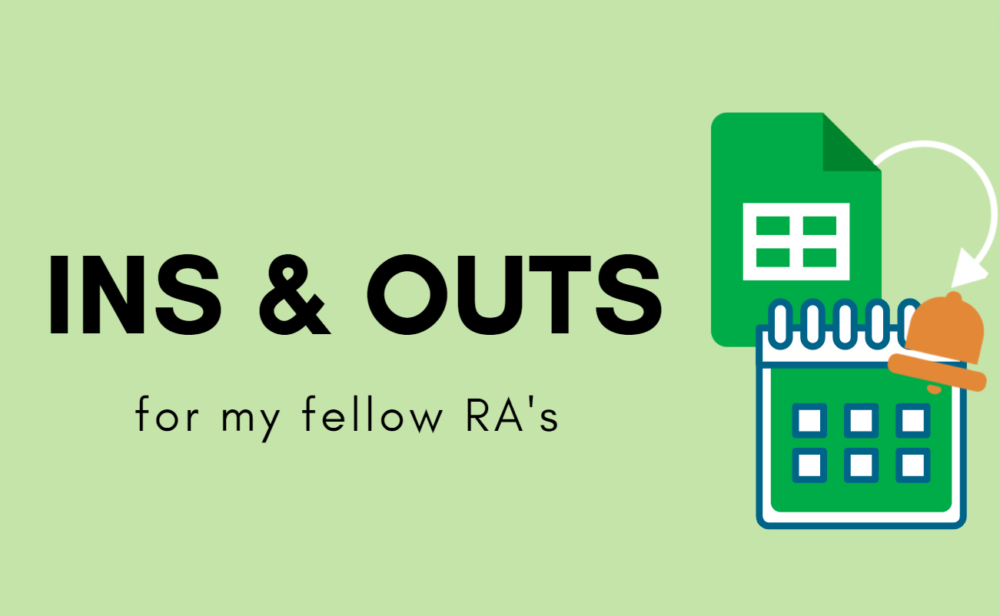
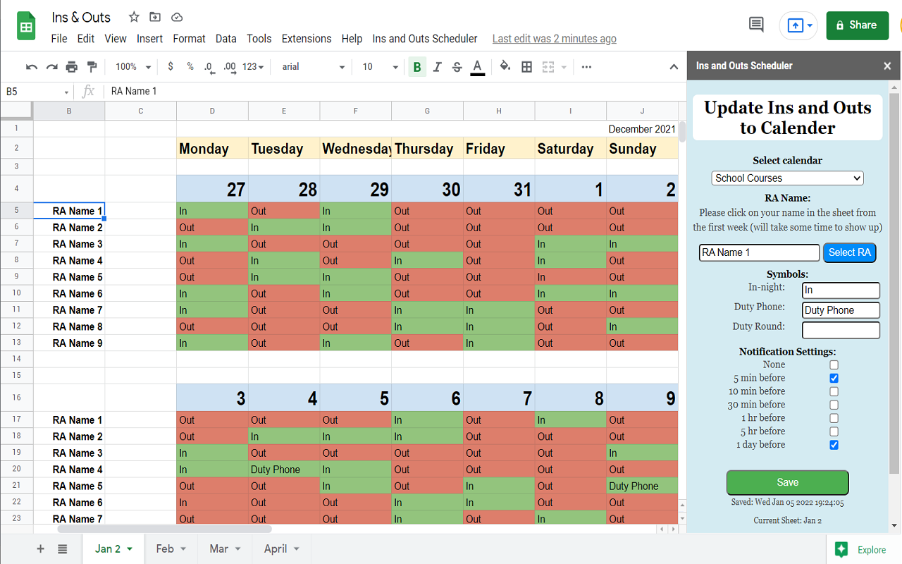
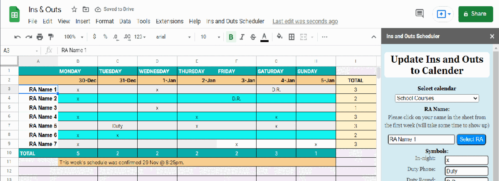

Automatically create Google CalendarTM events from Google SheetsTM schedule. Specifically designed 
for Resident Advisors (RA) working for the University of British Columbia Student Housing. This add-on will enable RA's
to easily keep track of their "ins and outs" schedule. Users may also recieve custom notification alerting them of an
upcoming work shift to mitigate the risk of forgetting or being late to "sign-in". As the RA "ins and outs" schedule can 
be updated or changed at any time, the add-on is designed to automatically update the users Google CalenderTM
whenever there is an edit to the Google SheetTM containing the schedule. 

## Instructions

**1. Select Calendar:**
From drop-down menu, select the calendar you wish to keep track of your in nights 

**2. RA Name:**
Click the RA Name of interest from the excel spreadsheet and then the blue button “select RA” to save your choice. Please make sure the name you click on is from the first week of the schedule (see picture above of blue outlined text box)

**3. Symbols:**
Write down the symbol you used in the spreadsheet that represents an “in-night”, “duty phone” and/or “duty round”. Leave blank if the options do not apply to you. 

**4. Notification Setting:**
Choose when you would like to be notified of sign in (7:50pm)

**5. Save:**
When everything is filled out, press the green button “Save”

You only need to initialize the add-on once. The add-on will update your personal calendar to reflect the Ins and Outs schedule every time you edit the spreadsheet. 

## Compatability
This add-on is desisgned with multiple schedule templates in mind. For example, it will work with the following: 

